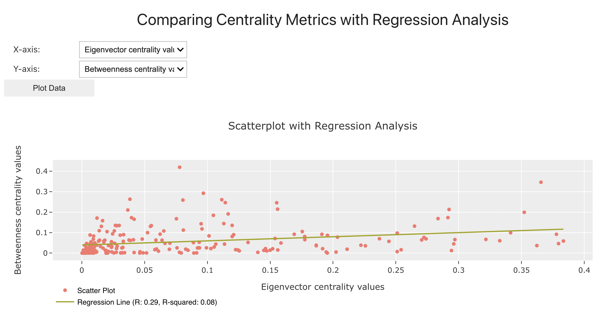

 

 

In the context of protein structure networks and drug development, scatterplots of different measures of network centrality, such as betweenness and closeness, can serve several purposes:

1. **Identifying Important Residues or Regions**: In protein structure networks, amino acid residues or regions can be represented as nodes, and interactions between residues can be represented as edges. By plotting different measures of network centrality for each residue or region, such as betweenness and closeness, researchers can identify important residues or regions that are critical for the stability, function, or interactions of the protein structure. These important residues may serve as potential drug binding sites or targets for drug development.

2. **Understanding Structural Connectivity**: Scatterplots of centrality measures can provide insights into the structural connectivity of protein networks. For example, a scatterplot of betweenness centrality versus closeness centrality can reveal whether residues that are highly central in terms of betweenness are also central in terms of closeness. Understanding these structural relationships can help researchers elucidate the functional implications of protein structure networks and identify key residues involved in protein-protein interactions or allosteric regulation.

3. **Prioritizing Druggable Sites**: Identifying druggable sites or regions within protein structures is crucial for drug development. Scatterplots of centrality measures can aid in prioritizing druggable sites by highlighting residues or regions that are highly central in the network. These highly central residues may represent hotspots for protein-protein interactions, allosteric regulation, or functional binding sites, making them attractive targets for drug development.

4. **Exploring Protein Dynamics**: Protein structure networks can provide insights into the dynamics and flexibility of protein structures. Scatterplots of centrality measures can help researchers explore how network centrality changes over time or in response to ligand binding, post-translational modifications, or mutations. Understanding the dynamic behavior of protein structure networks can inform drug design strategies aimed at targeting specific conformational states or modulating protein dynamics.

5. **Rational Drug Design**: Finally, scatterplots of centrality measures can inform rational drug design efforts by providing structural insights into protein-ligand interactions. By examining how network centrality measures correlate with ligand binding affinity or specificity, researchers can identify key residues involved in ligand recognition and design drugs that target these residues with high specificity and affinity.

Overall, scatterplots of different measures of network centrality play a valuable role in protein structure networks and drug development by aiding in the identification of important residues or regions, understanding structural connectivity, prioritizing druggable sites, exploring protein dynamics, and informing rational drug design strategies.

This information was generated with the assistance of OpenAI's GPT-3 language model.
